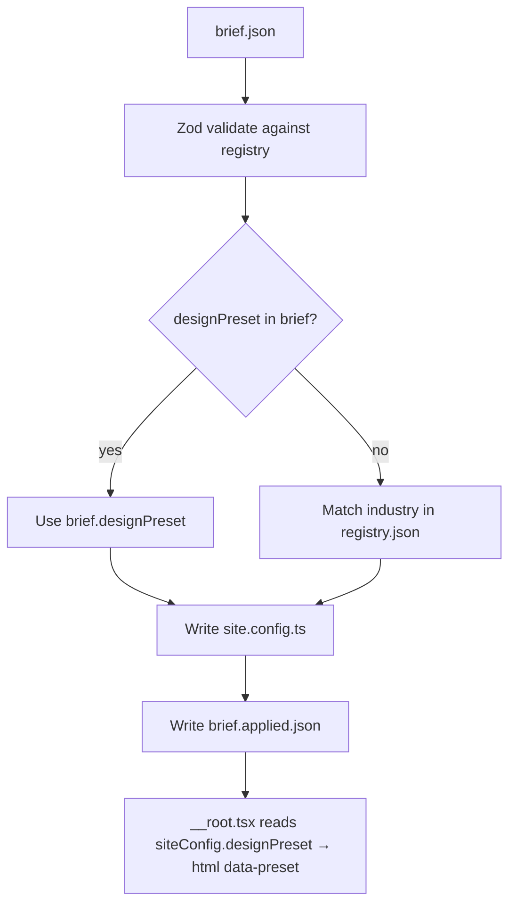

# Harness Guide — Themes & Brief Application

This document is the **single reference** for how your AI coding harness selects and applies themes automatically.

**Machine-readable index:** [`harness.manifest.json`](../harness.manifest.json) — paths, commands, and workflow for programmatic access.

## Harness workflow (automated)

```bash
# 1. Place client brief at repo root
cp client-brief.json brief.json

# 2. Apply brief → site config + theme (auto-resolves preset if omitted)
bun run apply-brief

# 3. Build (prebuild also runs apply-brief if brief.json exists)
bun run build

# 4. Deploy
bun run deploy
```

That's it. Theme selection is automatic.

---

## What happens when you run `apply-brief`



### Outputs

| File | Purpose |
|---|---|
| [`brief.json`](brief.json) | Harness input (you provide) |
| [`brief.applied.json`](brief.applied.json) | Machine-readable report: which theme was chosen and why |
| [`src/config/site.config.ts`](src/config/site.config.ts) | Generated site config including `designPreset` |
| `<html data-preset="...">` | Activates matching CSS in [`src/design/presets/vars/`](src/design/presets/vars/) |

### Read the report

```bash
cat brief.applied.json
```

Example:

```json
{
  "resolvedPreset": "trustworthy-blue",
  "resolutionSource": "brief",
  "presetLabel": "Trustworthy Blue",
  "presetCoverage": "accent",
  "htmlDataPreset": "trustworthy-blue"
}
```

`resolutionSource` values:

| Value | Meaning |
|---|---|
| `brief` | `brief.designPreset` was set and valid |
| `industry-inference` | No preset in brief; matched `business.industry` to registry |
| `default` | Brief preset invalid; fell back to industry/default |

---

## Theme registry (single source of truth)

**File:** [`src/design/presets/registry.json`](src/design/presets/registry.json)

Every theme the harness can use must be listed here. The registry drives:

- Zod validation (`src/lib/brief.ts` — preset IDs from registry)
- Agent catalog (`src/design/presets/catalog.ts`)
- CSS bundling (`src/design/presets/vars/index.css` — auto-generated)
- Industry → theme mapping

### Preset coverage types

| `coverage` | Meaning |
|---|---|
| `accent` | Overrides primary/ring colors only; base neutrals from `:root` |
| `full` | Full palette (background, borders, fonts, shadows) — tweakcn imports |

Prefer `full` (tweakcn) themes for distinctive client sites.

---

## Brief schema — theme fields

```json
{
  "business": {
    "industry": "plumber"
  },
  "designPreset": "trustworthy-blue"
}
```

- **`designPreset`** (optional): explicit theme ID from registry. If omitted, industry inference runs.
- **`business.industry`**: used for auto-selection (e.g. `plumber` → `trustworthy-blue`, `landscaping` → `forest-green` or `tweakcn-nature`).

See [`brief.example.json`](brief.example.json).

---

## Adding a tweakcn theme (fully automated)

```bash
# 1. Import from tweakcn registry (updates CSS + registry.json + index.css)
bun run theme:import nature --industries landscaping,gardening,eco-services

# 2. Sync (usually done by theme:import; run manually if needed)
bun run presets:sync

# 3. Use in brief
# "designPreset": "tweakcn-nature"
# OR omit and set "industry": "landscaping"

# 4. Apply
bun run apply-brief
```

No manual edits to `brief.ts`, `catalog.ts`, or `app.css` required.

---

## API for in-code use (TypeScript)

```ts
import { parseWebsiteBrief } from '~/lib/brief'
import { applyBriefToSiteConfig, resolveDesignPreset, createAppliedBriefReport } from '~/lib/apply-brief'
import { getPresetForIndustry, designPresetCatalog } from '~/design/presets'

// Auto-resolve theme from brief
const resolution = resolveDesignPreset(brief)
// → { presetId, source: 'brief' | 'industry-inference' | 'default', preset }

// Full site config from brief
const config = applyBriefToSiteConfig(brief)

// Harness logging
const report = createAppliedBriefReport(brief)
```

---

## Files the harness should read

| File | When |
|---|---|
| [`AGENTS.md`](AGENTS.md) | Always — top-level agent instructions |
| [`docs/HARNESS.md`](docs/HARNESS.md) | Theme + brief automation (this file) |
| [`docs/TWEAKCN_THEMES.md`](docs/TWEAKCN_THEMES.md) | tweakcn registry details |
| [`src/design/presets/registry.json`](src/design/presets/registry.json) | List of valid theme IDs + industries |
| [`brief.applied.json`](brief.applied.json) | After `apply-brief` — confirm theme applied |
| [`.agents/skills/design-presets/SKILL.md`](.agents/skills/design-presets/SKILL.md) | Agent skill for theme selection |

---

## Commands reference

| Command | Description |
|---|---|
| `bun run apply-brief` | Apply `brief.json` → `site.config.ts` + report |
| `bun run apply-brief -- --brief path.json` | Apply a specific brief file |
| `bun run theme:import <id>` | Import tweakcn theme into registry |
| `bun run presets:sync` | Regenerate `vars/index.css` from registry |
| `bun run build` | Runs `apply-brief --if-present` then builds |

---

## Troubleshooting

**Theme not changing after apply-brief**
- Check `brief.applied.json` → `resolvedPreset`
- Verify `src/config/site.config.ts` has matching `designPreset`
- Confirm preset exists in `registry.json` and CSS file in `vars/`

**Invalid designPreset in brief**
- Run `cat src/design/presets/registry.json | jq '.presets[].id'`
- Use an ID from that list, or omit `designPreset` for industry inference

**New theme not in build**
- Run `bun run presets:sync`
- Ensure `src/design/presets/vars/<id>.css` exists
