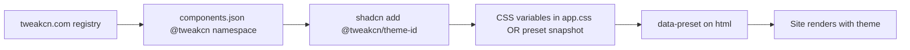

# Adding tweakcn Themes via Registry

This guide walks through how tweakcn themes are wired into this template. Two themes are already integrated as examples:

- `tweakcn-nature` — sage/green nature palette
- `tweakcn-ocean-breeze` — cool coastal blues

## How it works (overview)



---

## Step 1 — Register tweakcn in `components.json`

The shadcn CLI needs a namespace that points at tweakcn’s theme JSON endpoint:

```json
{
  "registries": {
    "@tweakcn": "https://tweakcn.com/r/themes/{name}.json"
  }
}
```

When you run `bunx shadcn add @tweakcn/nature`, the CLI fetches:
`https://tweakcn.com/r/themes/nature.json`

This is already configured in this repo’s [`components.json`](components.json).

---

## Step 2 — Browse available themes

**Built-in catalog** (36 themes):

```bash
curl -sS https://tweakcn.com/r/registry.json | python3 -c \
  "import json,sys; [print(i['name']) for i in json.load(sys.stdin)['items']]"
```

Examples: `nature`, `ocean-breeze`, `clean-slate`, `modern-minimal`, `supabase`, `vercel`.

**Community themes** on [tweakcn.com/community](https://tweakcn.com/community) use the same URL pattern if published:

```
https://tweakcn.com/r/themes/<theme-slug>.json
```

Open any theme on tweakcn → Code panel → copy the registry command (e.g. `npx shadcn@latest add @tweakcn/nature`).

---

## Step 3 — Preview before installing

Always dry-run first to see what changes:

```bash
bunx shadcn add @tweakcn/nature --dry-run
bunx shadcn add @tweakcn/nature --dry-run --diff src/styles/app.css
```

By default, tweakcn themes **merge CSS variables into `src/styles/app.css`** (`:root` + `.dark`). That overwrites your base theme — fine for a single-theme site, not for swappable presets.

---

## Step 4 — Snapshot as a swappable preset (this template’s approach)

For an agent harness with many themes, convert registry JSON → preset CSS file:

```bash
node scripts/tweakcn-theme-to-preset.mjs nature
node scripts/tweakcn-theme-to-preset.mjs ocean-breeze
```

This writes:
`src/design/presets/vars/tweakcn-<theme-id>.css`

Each file scopes variables under `[data-preset='tweakcn-nature']` so themes don’t clash.

Then:

1. **Import** the new CSS in [`src/styles/app.css`](src/styles/app.css)
2. **Add** entry to [`src/design/presets/catalog.ts`](src/design/presets/catalog.ts)
3. **Extend** `designPresetIds` in [`src/lib/brief.ts`](src/lib/brief.ts)
4. **Set** `designPreset: 'tweakcn-nature'` in [`src/config/site.config.ts`](src/config/site.config.ts)

---

## Step 5 — Apply at runtime

The active preset is set on `<html>`:

```html
<html data-preset="tweakcn-nature">
```

In this repo that comes from `site.config.designPreset` in [`src/routes/__root.tsx`](src/routes/__root.tsx).

To try a tweakcn theme locally, change `site.config.ts`:

```ts
designPreset: 'tweakcn-nature',  // or 'tweakcn-ocean-breeze'
```

Run `bun run dev` and reload.

---

## Step 6 — Agent selection

The agent picks presets via:

- `brief.designPreset` field
- `getPresetForIndustry()` in catalog
- [`.agents/skills/design-presets/SKILL.md`](.agents/skills/design-presets/SKILL.md)

tweakcn entries include `registryCommand` for reference if the agent needs to re-fetch or update a theme.

---

## Quick reference

| Action | Command |
|---|---|
| List built-in themes | `curl -sS https://tweakcn.com/r/registry.json` |
| Preview install | `bunx shadcn add @tweakcn/nature --dry-run` |
| Install globally (overwrites :root) | `bunx shadcn add @tweakcn/nature -y` |
| Add swappable preset | `node scripts/tweakcn-theme-to-preset.mjs <theme-id>` |
| Browse community | [tweakcn.com/community](https://tweakcn.com/community) |

---

## When to use which method

| Method | Use when |
|---|---|
| `shadcn add @tweakcn/...` directly | Single-theme client site; OK to overwrite `app.css` |
| `tweakcn-theme-to-preset.mjs` | Multi-theme agency template; agent picks preset per brief |
| Manual CSS from tweakcn editor | Custom tweaks after import |
